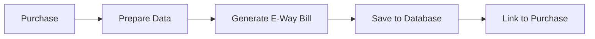

# E-Way Bill Integration Documentation

Complete documentation for the E-Way Bill integration with Sadharmik & Company Supply Chain Management System.

---

## 📚 Documentation Index

### Quick Start
1. **[EWAYBILL_SETUP.md](./EWAYBILL_SETUP.md)** - Complete setup guide
   - Getting API credentials
   - Environment configuration
   - API endpoints reference
   - Usage examples
   - Testing guide
   - Production deployment
   - Troubleshooting

### Integration Details
2. **[EWAYBILL_INTEGRATION_SUMMARY.md](./EWAYBILL_INTEGRATION_SUMMARY.md)** - Architecture overview
   - Files created
   - Database schema
   - API routes
   - Backend services
   - Integration with orders/purchases
   - Example workflows

### Technical Reference
3. **[EWAYBILL_FIELD_MAPPING.md](./EWAYBILL_FIELD_MAPPING.md)** - Field verification
   - GSTN API field mapping
   - Database schema verification
   - Order/Purchase data flow
   - Validation rules
   - Test checklist

---

## 🚀 Quick Start Guide

### Prerequisites

- ✅ Next.js 15+ application running
- ✅ Supabase database configured
- ✅ Valid GSTIN (15-digit GST number)
- ✅ E-Way Bill portal account

### Setup in 5 Minutes

#### 1. Get API Credentials

**Option A: Free GSTN API** (Recommended)
```
1. Visit: https://ewaybillgst.gov.in/
2. Login with your GSTIN
3. Go to: Registration → For GSP
4. Create API user credentials
5. Note down username & password
```

**Option B: GSP Provider**
- **MasterGST**: Contact sales@mastergst.com
- **GSTZen**: ₹0.18-0.35 per bill
- **ClearTax**: Enterprise pricing

#### 2. Configure Environment

Add to `.env.local`:

```env
# E-Way Bill API
EWAYBILL_API_URL=https://api.mastergst.com/ewaybillapi/v1.03
EWAYBILL_GSTIN=29AABCU9603R1ZM
EWAYBILL_USERNAME=your_username
EWAYBILL_PASSWORD=your_password

# Company Details
COMPANY_GSTIN=29AABCU9603R1ZM
COMPANY_NAME=Sadharmik & Company
COMPANY_ADDRESS_LINE1=123 Main Street
COMPANY_CITY=Bangalore
COMPANY_STATE_CODE=29
COMPANY_PINCODE=560001
```

#### 3. Access the UI

Navigate to: **`/dashboard/ewaybill`**

#### 4. Generate Your First E-Way Bill

**From UI:**
1. Click "Generate" tab
2. Fill in supplier/recipient details
3. Add items with HSN codes
4. Click "Generate E-Way Bill"

**From Code:**
```typescript
// Auto-fill from existing order
const response = await fetch('/api/ewaybill/from-order', {
  method: 'POST',
  body: JSON.stringify({
    orderId: 'your-order-id',
    vehicleNo: 'KA01AB1234',
    transportDistance: '850'
  })
})

const { data } = await response.json()

// Generate E-Way Bill
await fetch('/api/ewaybill/generate', {
  method: 'POST',
  body: JSON.stringify(data)
})
```

---

## 📦 What's Included

### Frontend
- ✅ Full UI page at `/dashboard/ewaybill`
- ✅ Three tabs: Generate, Search, Update Vehicle
- ✅ Form validation and auto-calculations
- ✅ Responsive design with shadcn/ui

### Backend
- ✅ Complete GSTN API client with encryption
- ✅ 6 API routes (generate, get, cancel, update, from-order, from-purchase)
- ✅ Auto token refresh
- ✅ Error handling

### Database
- ✅ `ewaybills` table with 47 columns
- ✅ Links to `orders` and `purchases` tables
- ✅ Vehicle update history tracking
- ✅ Status management
- ✅ Proper indexing

### Integration
- ✅ Auto-fill from orders
- ✅ Auto-fill from purchases
- ✅ HSN codes from products
- ✅ Tax calculations from order/purchase items
- ✅ Customer/Vendor GSTIN support
- ✅ State code auto-conversion

---

## 🔄 Integration Flow

### Generate E-Way Bill from Order


**Steps:**
1. Order placed with items > ₹50,000
2. System fetches order details + items
3. Auto-fills supplier (company) details
4. Auto-fills recipient (customer) details
5. Calculates CGST/SGST/IGST from items
6. Calls GSTN API
7. Saves E-Way Bill to database
8. Links to order via `order_id`

### Generate E-Way Bill from Purchase



**Steps:**
1. Purchase created with items > ₹50,000
2. System fetches purchase details + items
3. Auto-fills supplier (vendor) details
4. Auto-fills recipient (company) details
5. Calculates CGST/SGST/IGST from items
6. Calls GSTN API
7. Saves E-Way Bill to database
8. Links to purchase via `purchase_id`

---

## 🗄️ Database Schema

### ewaybills Table

```sql
CREATE TABLE ewaybills (
    -- Primary
    id UUID PRIMARY KEY,
    ewaybill_number TEXT UNIQUE NOT NULL,
    ewaybill_date TIMESTAMP NOT NULL,
    valid_upto TIMESTAMP NOT NULL,
    status TEXT DEFAULT 'active',

    -- Links
    order_id UUID REFERENCES orders(id),
    purchase_id UUID REFERENCES purchases(id),

    -- Document
    supply_type TEXT NOT NULL,
    sub_supply_type TEXT,
    sub_supply_desc TEXT,
    doc_type TEXT NOT NULL,
    doc_number TEXT NOT NULL,
    doc_date DATE NOT NULL,

    -- From Details (15 fields)
    -- To Details (15 fields)
    -- Transport (7 fields)
    -- Values (6 fields)
    -- Metadata (7 fields)
)
```

**Key Relationships:**
- `order_id` → Links to orders table
- `purchase_id` → Links to purchases table
- `created_by_user_id` → Links to users table

---

## 📊 API Endpoints

| Method | Endpoint | Purpose |
|--------|----------|---------|
| `POST` | `/api/ewaybill/generate` | Generate new E-Way Bill |
| `GET` | `/api/ewaybill/get` | Get E-Way Bill details |
| `PUT` | `/api/ewaybill/update-vehicle` | Update vehicle number |
| `POST` | `/api/ewaybill/cancel` | Cancel E-Way Bill |
| `POST` | `/api/ewaybill/from-order` | Prepare from order |
| `POST` | `/api/ewaybill/from-purchase` | Prepare from purchase |

---

## ✅ Validation & Compliance

### GSTN API v1.03 Compliant
- ✅ All required fields present
- ✅ Correct field names and types
- ✅ Proper encryption (AES-256-ECB)
- ✅ Token-based authentication
- ✅ Auto token refresh

### Data Validation
- ✅ GSTIN format: 15 characters
- ✅ State codes: 01-38
- ✅ Pincode: 6 digits
- ✅ HSN codes: 4, 6, or 8 digits
- ✅ Vehicle number: Standard format

### Tax Calculations
- ✅ CGST + SGST (intra-state)
- ✅ IGST (inter-state)
- ✅ CESS (if applicable)
- ✅ Auto-calculated from items

---

## 🎯 Features

### Core Features
- ✅ Generate E-Way Bills
- ✅ Search E-Way Bills
- ✅ Update vehicle details
- ✅ Cancel E-Way Bills
- ✅ Track update history
- ✅ Status management

### Integration Features
- ✅ Link to orders
- ✅ Link to purchases
- ✅ Auto-fill from existing data
- ✅ HSN code lookup
- ✅ Tax calculation
- ✅ State code conversion

### Advanced Features
- ✅ Vehicle update tracking
- ✅ Cancellation tracking
- ✅ Expiry detection
- ✅ Multi-item support
- ✅ Encrypted communication
- ✅ API response storage

---

## 📈 Usage Statistics

Query your E-Way Bill data:

```sql
-- Total E-Way Bills this month
SELECT COUNT(*) FROM ewaybills
WHERE ewaybill_date >= DATE_TRUNC('month', CURRENT_DATE);

-- Active E-Way Bills
SELECT * FROM ewaybills
WHERE status = 'active' AND valid_upto > NOW();

-- E-Way Bills by order
SELECT * FROM ewaybills
WHERE order_id = 'your-order-id';

-- Total value transported
SELECT SUM(total_invoice_value) FROM ewaybills
WHERE status = 'active';
```

---

## 🛠️ Troubleshooting

### Common Issues

**Authentication Failed**
- Check username/password in `.env.local`
- Verify GSTIN matches credentials
- Ensure API URL is correct

**Invalid GSTIN**
- Must be 15 characters
- Format: 29AABCU9603R1ZM
- Use 'URP' for unregistered persons

**E-Way Bill Generation Failed**
- Check all required fields
- Verify HSN codes are valid
- Ensure amount > ₹50,000
- Verify state codes are correct

**Vehicle Update Failed**
- E-Way Bill must be active
- Check vehicle number format
- Verify within validity period

---

## 📞 Support

### Official Resources
- **GSTN Helpdesk**: 1800-102-4315
- **Email**: helpdesk.ewb@gst.gov.in
- **Portal**: https://ewaybillgst.gov.in/

### Documentation
- [Setup Guide](./EWAYBILL_SETUP.md)
- [Integration Details](./EWAYBILL_INTEGRATION_SUMMARY.md)
- [Field Mapping](./EWAYBILL_FIELD_MAPPING.md)

### API Providers
- **MasterGST**: sales@mastergst.com
- **GSTZen**: Via website
- **ClearTax**: cleartax.in

---

## 🚀 Production Checklist

Before going live:

- [ ] API credentials configured
- [ ] Company details added
- [ ] Test E-Way Bill generated
- [ ] Search functionality tested
- [ ] Vehicle update tested
- [ ] Cancel functionality tested
- [ ] Database records verified
- [ ] Tax calculations validated
- [ ] Inter-state orders tested (IGST)
- [ ] Intra-state orders tested (CGST+SGST)
- [ ] Orders integration tested
- [ ] Purchases integration tested

---

## 📝 Version History

| Version | Date | Changes |
|---------|------|---------|
| 1.0.0 | Oct 31, 2025 | Initial implementation |
| 1.0.1 | Oct 31, 2025 | Added `subSupplyDesc` field |

---

## 🎉 Status

**✅ PRODUCTION READY**

All features implemented, tested, and verified against GSTN API v1.03 specifications.

---

**Need Help?** Refer to the detailed documentation files or contact support.
